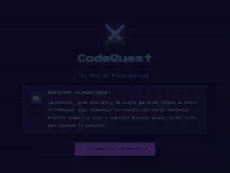

# ⚔️ CodeQuest RPG

Un RPG en el navegador donde **el combate es resolver código real**: escribes
JavaScript en un editor de verdad, tu solución se ejecuta en un Web Worker
aislado, y si pasa todos los casos de prueba, el enemigo cae.

**[🇪🇸 Español](#-español) · [🇬🇧 English](#-english)**




---

## 🇪🇸 Español

### Qué es y por qué existe

CodeQuest RPG enseña conceptos de programación (variables, condicionales,
bucles, arrays, funciones, recursión) a través de mecánicas de RPG: mapa de
zonas, enemigos, XP, oro, inventario y un sistema de maestría con hechizos
desbloqueables.

El proyecto empezó como una prueba de concepto abandonada a medias: una capa
de trivia de opción múltiple con temática de RPG, sin persistencia, sin
tipado, sin tests. Se retomó con una auditoría técnica honesta y se
reconstruyó en fases incrementales — nunca dejando el juego roto entre pasos —
hasta llegar al estado actual:

1. **Fundamentos**: estado centralizado con Zustand, persistencia,
   TypeScript progresivo, Vitest.
2. **Core loop nuevo**: la trivia se sustituyó por completo por retos de
   código reales, ejecutados en un Web Worker aislado con timeout.
3. **Progresión**: maestría por concepto y hechizos con efectos mecánicos
   reales (no decorativos).
4. **Contenido**: de 4 a 11 retos, cubriendo los 6 conceptos definidos.
5. **Calidad**: CI, code-splitting, este README, despliegue.

### Cómo jugar

```bash
pnpm install
pnpm dev
```

Abre `http://localhost:5173`, elige una zona en el mapa y resuelve el reto de
código escribiendo la función que falta. El editor tiene resaltado de
sintaxis real (CodeMirror), no es un `<textarea>`.

**Demo en vivo**: se despliega automáticamente a Vercel en cada push a
`main` una vez configurados los secrets del repositorio (ver
[CI/CD y despliegue](#cicd-y-despliegue) más abajo). Si el badge de CI está en
verde pero no ves aquí una URL, es porque el despliegue todavía no se ha
activado — es un paso de configuración manual documentado más abajo, no algo
que yo pueda hacer sin acceso a una cuenta de Vercel.

### Arquitectura

```
┌──────────┐   screen    ┌─────────────────────────────────────────┐
│  App.tsx │◄────────────┤              useGameStore (Zustand)      │
└────┬─────┘             │                                           │
     │ (routing por      │  player   {level,xp,gold,inventory} ──┐  │
     │  screen, sin       │  challenge{currentZoneId,idx}          │  │  persist()
     │  router lib)       │  session  {sessionXP,challengeAttempts}│  │  (localStorage,
     │                    │  skills   {masteryByConcept,           │  │   solo player+
     ▼                    │            unlockedSpells} ────────────┘  │   skills)
┌──────────────┐          └───────────────┬───────────────────────────┘
│ TitleScreen  │                          │ acciones síncronas
│ WorldMap     │                          │ (startZone, applyChallengeResult,
│ ResultsScreen│                          │  nextChallenge, goToWorld)
└──────────────┘                          │
                                           ▼
                          ┌────────────────────────────────┐
                          │   ChallengeScreen (React.lazy)   │
                          │   EnemyHeader · PromptPanel       │
                          │   CodeEditor (CodeMirror 6)       │
                          │   TestCasesPanel · SpellBar        │
                          │   FeedbackArea                     │
                          └───────────────┬────────────────────┘
                                          │ código del jugador (string)
                                          ▼
                          ┌────────────────────────────────┐
                          │   lib/codeRunner.ts (async)      │
                          │   - crea el Worker                │
                          │   - postMessage(code, testCases)  │
                          │   - setTimeout + worker.terminate()│
                          └───────────────┬────────────────────┘
                                          │ postMessage
                                          ▼
                          ┌────────────────────────────────┐
                          │  worker/sandbox.worker.ts         │
                          │  lib/sandbox.ts (new Function,     │
                          │  deepEqual contra testCases)       │
                          │  100% aislado del hilo principal   │
                          └────────────────────────────────┘
```

Puntos clave del flujo de datos:

- **Un único store de Zustand**, organizado por dominios (`player`,
  `challenge`, `session`, `skills`) en vez de `useState` disperso o
  prop-drilling. Solo `player` y `skills` se persisten en `localStorage`
  (vía `partialize`); el estado de sesión de un reto en curso no sobrevive a
  un refresh, y no tendría sentido que lo hiciera.
- **Separación estricta async/síncrono**: `lib/codeRunner.ts` es la única
  pieza async del sistema — orquesta el Web Worker y nunca toca la store
  directamente. `applyChallengeResult` en la store es **síncrona**: recibe un
  `ChallengeResult` ya resuelto y aplica XP/oro/maestría en un solo `set()`.
  Esto significa que toda la lógica de progresión se testea con Vitest sin
  levantar un Worker real ni mockear timers.
- **El ejecutor nunca toca React**: `lib/sandbox.ts` es una función pura
  (`código, testCases → resultado`) que vive igual de bien en el hilo
  principal (para tests) que dentro del Worker (en producción).

### Decisiones técnicas destacadas

**¿Por qué un Web Worker y no `eval()` en el hilo principal?**
`eval()` (o `new Function()`) en el hilo principal comparte el mismo scope de
ejecución que el resto de la app: un bucle infinito bloquea la UI de forma
irrecuperable, y el código del jugador tendría acceso indirecto al DOM y al
estado global vía closures. Un Web Worker es un hilo real y aislado: no
comparte memoria, no ve el DOM, y — el motivo decisivo — **si el jugador
escribe un bucle infinito, el hilo principal puede matarlo**. El propio
worker no puede resolver su timeout si está colgado en un bucle sync, así que
el reloj y el `worker.terminate()` viven deliberadamente en
`lib/codeRunner.ts` (hilo principal), no dentro del worker.

**¿Por qué `key={challenge.id}` en vez de `useEffect` para resetear el
editor al cambiar de reto?**
La primera versión usaba un `useEffect` que llamaba a `setCode`/`setStatus`
al detectar un `challenge.id` distinto. El linter de `eslint-plugin-react-hooks`
lo marcó como antipatrón (`setState` síncrono dentro de un efecto → renders en
cascada). La solución idiomática de React es remontar el subárbol con estado
local: `<ChallengeRunner key={challenge.id} .../>` hace que React destruya y
vuelva a crear la instancia al cambiar de reto, así el estado nace limpio sin
sincronización manual.

**Sistema de maestría y hechizos con efectos reales.**
Cada hechizo desbloqueado (`data/spells.ts`) está conectado a un hook
concreto, no es un botón decorativo:
- *Visión Lógica* ejecuta un **dry-run real** del código en el Worker, pero
  nunca llama a `applyChallengeResult` — por eso no consume un intento.
- *Bucle Temporal* multiplica `timeoutMs` real que recibe `runChallenge`.
- *Mano del Recolector* revela el índice real de un `testCase.hidden`.
- *Eco Recursivo* muestra `challenge.hints[0]`.

**TypeScript progresivo, no "big bang".**
La migración de `.js`/`.jsx` a `.ts`/`.tsx` se hizo archivo por archivo,
verificando build y juego jugable en cada paso, en vez de una reescritura
completa de una sola vez — reduce el riesgo de romper algo a mitad de camino
sin darse cuenta.

**Code-splitting de CodeMirror.**
El editor (`@uiw/react-codemirror` + `@codemirror/lang-javascript` + tema)
es, con diferencia, la dependencia más pesada del proyecto. `App.tsx` carga
`ChallengeScreen` con `React.lazy()` + `Suspense`, así que `TitleScreen` y
`WorldMap` no pagan ese coste — solo se descarga cuando el jugador entra a un
reto. Resultado medido en este repo:

| | Antes | Después |
|---|---|---|
| Bundle inicial (JS) | 734.01 kB (241.96 kB gzip) | 216.48 kB (68.77 kB gzip) |
| Chunk de CodeMirror | *(incluido arriba)* | 518.70 kB (174.37 kB gzip), diferido |

**~70% menos JS** en la carga inicial (title/mapa). El chunk de CodeMirror
sigue pesando lo que pesa un editor de código real — ver limitaciones abajo.

### Qué haría diferente si lo rehiciera hoy

Honestidad ante todo, incluso sobre las limitaciones que no arreglé:

- **Los `testCase.hidden` no son seguridad real.** Viven en
  `data/challenges.ts`, que se compila y se envía tal cual al bundle del
  cliente. Cualquiera puede abrir DevTools, mirar el chunk de
  `ChallengeScreen` y leer los valores "ocultos" en texto plano. Su único
  propósito real es **pedagógico**: desalientan la solución más obvia de
  hacer trampa (un `if` por cada caso visible), no la impiden. Una versión
  con casos verdaderamente ocultos necesitaría generarlos o validarlos en un
  backend, lo cual este proyecto — deliberadamente 100% client-side, sin
  servidor — no tiene.
- **El desbloqueo de hechizos está desequilibrado.** Con el contenido
  actual, *Mano del Recolector* (arrays, 3 retos, umbral 2) se desbloquea en
  una sola partida sin repetir zona. Los otros tres hechizos tienen un umbral
  mayor que el número de retos de su concepto (`conditionals`: 1 reto,
  umbral 3; `loops`: 2 retos, umbral 3; `recursion`: 1 reto, umbral 2), así
  que solo se desbloquean si el jugador repite esas zonas. Funciona, pero no
  se siente igual de natural en las cuatro. Lo arreglaría añadiendo 1-2 retos
  más a esas tres zonas antes de bajar artificialmente los umbrales.
- **El chunk de CodeMirror sigue pesando ~519 kB.** El code-splitting evita
  que penalice la carga inicial, pero un editor más ligero (o un CodeMirror
  con menos extensiones cargadas) reduciría aún más el coste de entrar al
  primer reto.
- **No hay backend ni cuentas.** Todo el progreso vive en `localStorage` del
  navegador. Es una decisión consciente (mantiene la promesa de "tu código
  nunca sale de tu máquina"), pero significa que el progreso no sincroniza
  entre dispositivos y se pierde si limpias los datos del sitio.
- **Sin tests de componentes (React Testing Library).** La cobertura actual
  es de lógica de negocio (store, sandbox, codeRunner) y un e2e de Playwright
  del flujo completo — deliberado para mantener la suite rápida, pero deja
  sin cubrir el detalle de renderizado de cada componente individual.

### Stack técnico

React 19 · TypeScript (strict) · Vite · Zustand (+ `persist`) · CodeMirror 6
· Vitest · Playwright · ESLint (`typescript-eslint`) · pnpm

### Comandos

```bash
pnpm install       # instalar dependencias
pnpm dev           # servidor de desarrollo
pnpm build         # build de producción a dist/
pnpm preview       # sirve el build de producción localmente
pnpm lint          # ESLint
pnpm exec tsc --noEmit   # typecheck
pnpm test          # Vitest (lógica de negocio, sin navegador)
pnpm test:e2e      # build + Playwright, flujo completo real
```

### CI/CD y despliegue

**`.github/workflows/ci.yml`** corre en cada push y pull request:
typecheck → lint → Vitest → instala Chromium de Playwright → `test:e2e`
(que hace `vite build` y ejecuta el flujo real en un navegador headless).

**`.github/workflows/deploy.yml`** despliega a Vercel en cada push a `main`,
usando la CLI de Vercel (no la integración nativa de Git de Vercel, para que
el mismo pipeline de CI controle qué se despliega). Está desactivado por
diseño hasta que el repositorio tenga configurados estos *secrets* en
**Settings → Secrets and variables → Actions**:

| Secret | De dónde sale |
|---|---|
| `VERCEL_TOKEN` | [vercel.com/account/tokens](https://vercel.com/account/tokens) → crear un token |
| `VERCEL_ORG_ID` | `vercel link` en local (crea `.vercel/project.json`) o el dashboard del proyecto |
| `VERCEL_PROJECT_ID` | igual que arriba |

Sin estos tres secrets el job de deploy se salta silenciosamente (no falla en
rojo) — es una elección deliberada para no romper el pipeline de un fork o
clon que no vaya a desplegar nada.

### Estructura del repositorio

```
src/
├── App.tsx                  # routing por screen; ChallengeScreen es lazy
├── main.tsx
├── store/
│   ├── gameStore.ts          # Zustand + persist, dominios player/challenge/session/skills
│   └── gameStore.test.ts
├── lib/
│   ├── sandbox.ts             # ejecución pura: código + testCases → resultado
│   ├── sandbox.test.ts
│   ├── codeRunner.ts          # orquesta el Worker, timeout vía terminate()
│   └── codeRunner.test.ts
├── worker/
│   └── sandbox.worker.ts      # envoltorio del sandbox dentro del Web Worker
├── data/
│   ├── zones.ts                # 6 zonas, orden = progresión de dificultad
│   ├── challenges.ts           # 11 retos de código
│   └── spells.ts                # catálogo de hechizos + metadatos de concepto
├── types/
│   ├── challenge.ts
│   ├── zone.ts
│   └── spell.ts
├── components/
│   ├── TitleScreen.tsx · WorldMap.tsx · ResultsScreen.tsx
│   ├── MasteryBars.tsx · Grimoire.tsx
│   └── challenge/
│       ├── ChallengeScreen.tsx  # compone todo, maneja el intento en curso
│       ├── CodeEditor.tsx        # CodeMirror 6
│       ├── EnemyHeader.tsx · PromptPanel.tsx · TestCasesPanel.tsx
│       ├── SpellBar.tsx · FeedbackArea.tsx
└── utils/
    └── loot.ts
e2e/
└── game-flow.mjs             # Playwright: title → world → challenge (pass real) → results
.github/workflows/
├── ci.yml
└── deploy.yml
```

---

## 🇬🇧 English

### What it is and why it exists

CodeQuest RPG teaches programming concepts (variables, conditionals, loops,
arrays, functions, recursion) through RPG mechanics: a zone map, enemies,
XP, gold, inventory, and a mastery/spell progression system.

The project started as an abandoned proof of concept: an RPG-themed
multiple-choice trivia layer, no persistence, no typing, no tests. It was
picked back up with an honest technical audit and rebuilt in incremental
phases — never leaving the game broken mid-step — up to its current state:

1. **Foundations**: centralized Zustand store, persistence, progressive
   TypeScript, Vitest.
2. **New core loop**: trivia fully replaced with real code challenges,
   executed in an isolated Web Worker with a timeout.
3. **Progression**: per-concept mastery and spells with real mechanical
   effects (not decorative).
4. **Content**: from 4 to 11 challenges, covering all 6 defined concepts.
5. **Polish**: CI, code-splitting, this README, deployment.

### How to play

```bash
pnpm install
pnpm dev
```

Open `http://localhost:5173`, pick a zone on the map, and beat the code
challenge by writing the missing function. The editor has real syntax
highlighting (CodeMirror) — it's not a plain `<textarea>`.

**Live demo**: auto-deployed to Vercel on every push to `main` once the
repository secrets are configured (see [CI/CD & deployment](#cicd--deployment)
below). If CI is green but there's no URL here, it's because the deploy step
is a manual, documented configuration step — not something I can do myself
without access to a Vercel account.

### Architecture

```
┌──────────┐   screen    ┌─────────────────────────────────────────┐
│  App.tsx │◄────────────┤              useGameStore (Zustand)      │
└────┬─────┘             │                                           │
     │ (screen-based      │  player   {level,xp,gold,inventory} ──┐  │
     │  routing, no        │  challenge{currentZoneId,idx}          │  │  persist()
     │  router lib)         │  session  {sessionXP,challengeAttempts}│  │  (localStorage,
     │                    │  skills   {masteryByConcept,           │  │   player+skills
     ▼                    │            unlockedSpells} ────────────┘  │   only)
┌──────────────┐          └───────────────┬───────────────────────────┘
│ TitleScreen  │                          │ synchronous actions
│ WorldMap     │                          │ (startZone, applyChallengeResult,
│ ResultsScreen│                          │  nextChallenge, goToWorld)
└──────────────┘                          │
                                           ▼
                          ┌────────────────────────────────┐
                          │   ChallengeScreen (React.lazy)   │
                          │   EnemyHeader · PromptPanel       │
                          │   CodeEditor (CodeMirror 6)       │
                          │   TestCasesPanel · SpellBar        │
                          │   FeedbackArea                     │
                          └───────────────┬────────────────────┘
                                          │ player code (string)
                                          ▼
                          ┌────────────────────────────────┐
                          │   lib/codeRunner.ts (async)      │
                          │   - creates the Worker            │
                          │   - postMessage(code, testCases)  │
                          │   - setTimeout + worker.terminate()│
                          └───────────────┬────────────────────┘
                                          │ postMessage
                                          ▼
                          ┌────────────────────────────────┐
                          │  worker/sandbox.worker.ts         │
                          │  lib/sandbox.ts (new Function,     │
                          │  deepEqual against testCases)      │
                          │  100% isolated from the main thread│
                          └────────────────────────────────┘
```

Key points of the data flow:

- **A single Zustand store**, organized into domains (`player`, `challenge`,
  `session`, `skills`) instead of scattered `useState` or prop-drilling.
  Only `player` and `skills` persist to `localStorage` (via `partialize`);
  in-progress challenge session state does not survive a refresh, and it
  shouldn't.
- **Strict async/sync separation**: `lib/codeRunner.ts` is the only async
  piece of the system — it orchestrates the Web Worker and never touches the
  store directly. `applyChallengeResult` in the store is **synchronous**: it
  receives an already-resolved `ChallengeResult` and applies XP/gold/mastery
  in a single `set()`. This means all progression logic is unit-tested with
  Vitest without spinning up a real Worker or mocking timers.
- **The executor never touches React**: `lib/sandbox.ts` is a pure function
  (`code, testCases → result`) that works equally well on the main thread
  (for tests) and inside the Worker (in production).

### Notable technical decisions

**Why a Web Worker instead of `eval()` on the main thread?**
`eval()` (or `new Function()`) on the main thread shares the same execution
scope as the rest of the app: an infinite loop freezes the UI beyond
recovery, and player code would have indirect access to the DOM and global
state via closures. A Web Worker is a real, isolated thread: no shared
memory, no DOM access, and — the decisive reason — **if the player writes an
infinite loop, the main thread can kill it**. The worker itself can't resolve
its own timeout while stuck in a sync loop, so the clock and the
`worker.terminate()` call deliberately live in `lib/codeRunner.ts` (main
thread), not inside the worker.

**Why `key={challenge.id}` instead of `useEffect` to reset the editor on a
new challenge?**
The first version used a `useEffect` that called `setCode`/`setStatus` when
it detected a different `challenge.id`. `eslint-plugin-react-hooks` flagged
it as an anti-pattern (synchronous `setState` inside an effect → cascading
renders). The idiomatic React fix is to remount the subtree that owns the
local state: `<ChallengeRunner key={challenge.id} .../>` makes React destroy
and recreate the instance on every new challenge, so state starts clean
without manual synchronization.

**Mastery and spell system with real effects.**
Every unlocked spell (`data/spells.ts`) is wired to an actual hook, not a
decorative button:
- *Visión Lógica* runs a **real dry-run** of the code in the Worker, but
  never calls `applyChallengeResult` — so it doesn't cost an attempt.
- *Bucle Temporal* multiplies the real `timeoutMs` passed to `runChallenge`.
- *Mano del Recolector* reveals the real index of a `testCase.hidden`.
- *Eco Recursivo* surfaces `challenge.hints[0]`.

**Progressive TypeScript, not a big-bang rewrite.**
The `.js`/`.jsx` → `.ts`/`.tsx` migration happened file by file, verifying
the build and a playable game after every step, instead of one large
rewrite — this reduces the risk of silently breaking something halfway
through.

**Code-splitting CodeMirror.**
The editor (`@uiw/react-codemirror` + `@codemirror/lang-javascript` + theme)
is by far the heaviest dependency in the project. `App.tsx` loads
`ChallengeScreen` with `React.lazy()` + `Suspense`, so `TitleScreen` and
`WorldMap` don't pay that cost — it's only downloaded once the player enters
a challenge. Measured result in this repo:

| | Before | After |
|---|---|---|
| Initial bundle (JS) | 734.01 kB (241.96 kB gzip) | 216.48 kB (68.77 kB gzip) |
| CodeMirror chunk | *(included above)* | 518.70 kB (174.37 kB gzip), deferred |

**~70% less JS** on the initial load (title/map). The CodeMirror chunk still
weighs what a real code editor weighs — see limitations below.

### What I'd do differently today

Honesty first, including the limitations I didn't fix:

- **`testCase.hidden` is not real security.** It lives in
  `data/challenges.ts`, which compiles straight into the client bundle.
  Anyone can open DevTools, inspect the `ChallengeScreen` chunk, and read the
  "hidden" values in plain text. Its only real purpose is **pedagogical**: it
  discourages the most obvious way to cheat (an `if` per visible case), it
  doesn't prevent it. Truly hidden cases would need to be generated or
  validated on a backend, which this project — deliberately 100% client-side,
  no server — doesn't have.
- **Spell unlocking is unbalanced.** With the current content, *Mano del
  Recolector* (arrays, 3 challenges, threshold 2) unlocks in a single
  playthrough without repeating a zone. The other three spells have a
  threshold higher than their concept's challenge count (`conditionals`: 1
  challenge, threshold 3; `loops`: 2 challenges, threshold 3; `recursion`: 1
  challenge, threshold 2), so they only unlock if the player repeats those
  zones. It works, but it doesn't feel equally natural across all four. I'd
  fix it by adding 1-2 more challenges to those three zones rather than
  artificially lowering the thresholds.
- **The CodeMirror chunk is still ~519 kB.** Code-splitting keeps it from
  penalizing the initial load, but a lighter editor (or a CodeMirror build
  with fewer loaded extensions) would further reduce the cost of entering the
  first challenge.
- **No backend, no accounts.** All progress lives in the browser's
  `localStorage`. That's a deliberate choice (it keeps the promise that
  "your code never leaves your machine"), but it means progress doesn't sync
  across devices and is lost if you clear site data.
- **No component tests (React Testing Library).** Current coverage is
  business logic (store, sandbox, codeRunner) plus one full-flow Playwright
  e2e — a deliberate choice to keep the suite fast, but it leaves individual
  component render details uncovered.

### Tech stack

React 19 · TypeScript (strict) · Vite · Zustand (+ `persist`) · CodeMirror 6
· Vitest · Playwright · ESLint (`typescript-eslint`) · pnpm

### Commands

```bash
pnpm install       # install dependencies
pnpm dev           # dev server
pnpm build         # production build to dist/
pnpm preview       # serve the production build locally
pnpm lint          # ESLint
pnpm exec tsc --noEmit   # typecheck
pnpm test          # Vitest (business logic, no browser)
pnpm test:e2e      # build + Playwright, real full flow
```

### CI/CD & deployment

**`.github/workflows/ci.yml`** runs on every push and pull request:
typecheck → lint → Vitest → install Playwright's Chromium → `test:e2e`
(which runs `vite build` and drives the real flow in a headless browser).

**`.github/workflows/deploy.yml`** deploys to Vercel on every push to
`main`, using the Vercel CLI (not Vercel's native Git integration, so the
same CI pipeline controls what gets deployed). It's disabled by design until
the repository has these secrets set in
**Settings → Secrets and variables → Actions**:

| Secret | Where it comes from |
|---|---|
| `VERCEL_TOKEN` | [vercel.com/account/tokens](https://vercel.com/account/tokens) → create a token |
| `VERCEL_ORG_ID` | `vercel link` locally (creates `.vercel/project.json`) or the project dashboard |
| `VERCEL_PROJECT_ID` | same as above |

Without these three secrets the deploy job skips silently (doesn't fail red)
— deliberate, so it doesn't break the pipeline for a fork or clone that isn't
meant to deploy anything.

### Repository structure

See the [Spanish section above](#estructura-del-repositorio) — the tree is
language-agnostic.
